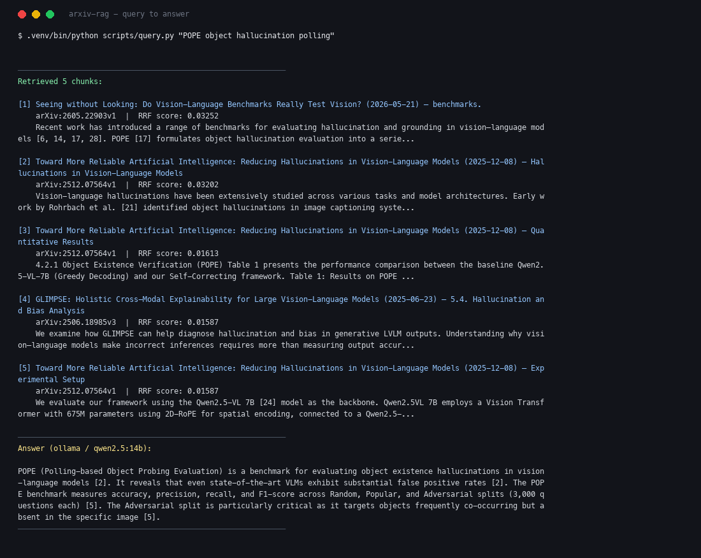

# arxiv-rag

Local hybrid RAG over arXiv ML/AI papers. Fetch → section-aware chunk → embed →
**BM25 + dense (RRF)** → relevance gate → grounded answer via Ollama (Qwen 2.5)
or OpenAI. Ships with a streaming HTTP API and a zero-build web UI.

Built to be measurable. Every claim below is reproducible with a command in this
repo; the numbers live in [EVAL.md](EVAL.md).



<sub>Live session: [`docs/demo-session.txt`](docs/demo-session.txt) · vector: [`docs/demo.svg`](docs/demo.svg)</sub>

## Does hybrid retrieval actually help?

Ablated over 97 scored queries, 115 papers / 3288 chunks:

| retriever | recall@5 | MRR | paraphrase (37) | rare token (32) | capability (6) |
|---|---|---|---|---|---|
| dense only | 94.85% | 0.888 | 89% | 97% | **0.889** |
| BM25 only | 91.75% | 0.840 | 81% | 100% | 0.556 |
| **hybrid RRF** | **96.91%** | **0.936** | **92%** | **100%** | 0.875 |

```bash
.venv/bin/python scripts/eval_recall.py --ablate
```

Dense wins paraphrase, BM25 wins rare technical tokens, fusion takes both. That
split is the entire argument for hybrid, and it only became visible after the
eval set grew from 15 to 76 cases — at n=15 all three tied at 93.33%, because
one case was worth 6.7pp and the effect being measured is 2.6pp.

The `capability` slice is where that argument stops holding: those queries name
an ability ("physical properties like mass and friction") while every candidate
paper is topically identical, so BM25 has nothing to match (MRR 0.556) and RRF
carries that noise into hybrid — the one slice where fusion scores **below**
dense alone. See [EVAL.md](EVAL.md).

**Stack:** arXiv API → PyMuPDF → sentence-transformers (MPS on Apple Silicon) →
ChromaDB + BM25 → FastAPI (SSE) → Ollama / OpenAI

## Quickstart

### 1. Environment

```bash
cd arxiv-rag
python3 -m venv .venv
source .venv/bin/activate
pip install -r requirements.txt
```

### 2. Ollama (default backend)

```bash
brew install ollama          # macOS
ollama pull qwen2.5:14b      # ~9 GB
ollama serve                 # keep running in another terminal
```

**OpenAI fallback:** `export OPENAI_API_KEY=...` and `export ARXIV_RAG_BACKEND=openai`

### 3. Ingest

```bash
.venv/bin/python scripts/ingest.py "vision language model evaluation" --n 30
.venv/bin/python scripts/ingest.py --ids 2605.22903,2306.09265,2406.12384
.venv/bin/python scripts/ingest.py --list
```

Parses in parallel across all cores and rebuilds BM25 once per run — 12.7 s to
re-index (measured at 109 PDFs; not re-run since the corpus grew to 115).

### 4. Query — CLI

```bash
.venv/bin/python scripts/query.py "POPE object hallucination polling"
.venv/bin/python scripts/query.py "what is the capital of France?"   # refuses
```

### 5. Serve — API + web UI

```bash
.venv/bin/uvicorn arxiv_rag.api:app --reload --port 8001
```

Open <http://localhost:8001>. Interactive API docs at `/docs`.

| endpoint | purpose |
|---|---|
| `GET /api/health` | index size, models, whether exact search is active |
| `POST /api/search` | retrieval only — fast, and the best debugging surface |
| `POST /api/chat` | SSE stream: `sources` → `token`… → `done` |

```bash
curl -s localhost:8001/api/health | python3 -m json.tool
curl -s -X POST localhost:8001/api/search -H 'Content-Type: application/json' \
  -d '{"query":"CLIP","mode":"hybrid","k":3}'
curl -N -X POST localhost:8001/api/chat -H 'Content-Type: application/json' \
  -d '{"query":"how is POPE used to evaluate hallucination?"}'
```

`mode` accepts `hybrid` | `dense` | `bm25`, so the ablation is switchable live
in the browser. Every result carries `dense_rank` / `bm25_rank` / `rrf_score`,
which makes fusion visible rather than asserted.

### 6. Eval / latency / tests

```bash
.venv/bin/python scripts/eval_recall.py --ablate    # retriever comparison
.venv/bin/python scripts/eval_recall.py --gate      # abstain threshold sweep
.venv/bin/python scripts/bench_latency.py --rounds 15
pytest tests/ -v
```

## Architecture

```
arXiv API
   │
   ▼
fetch.py          metadata + PDFs (ToS rate-limited, cached on disk)
   │
   ▼
parse.py          font-metric section detection, NFKD ligature fix,
                  parallel across cores
   │
   ▼
embed.py          all-MiniLM-L6-v2 (MPS when available)
   │
   ├─── index.py  ChromaDB + exact matmul (dense) · BM25Okapi (sparse)
   │              batched rebuild; both persisted to disk
   ▼
retrieve.py       Reciprocal Rank Fusion + dense_rank / bm25_rank provenance
   │
   ▼   relevance gate — below Config.min_relevance the LLM is never invoked
   │
generate.py       excerpt-numbered context; refuses when unsupported
   │
   ▼
api.py            FastAPI + SSE streaming, citation check, static web UI
```

## Configuration

`arxiv_rag/config.py` or env:

| Setting | Default | Notes |
|---|---|---|
| `embed_model` | `all-MiniLM-L6-v2` | swap `all-mpnet-base-v2` for quality |
| `embed_device` | auto | pin `cpu` for reproducible measurement |
| `chunk_size` / `chunk_overlap` | 512 / 64 words | |
| `top_k` / `final_k` | 8 / 5 | per-retriever candidates → LLM context |
| `rrf_k` | 60 | RRF damping; higher rewards consensus |
| `min_relevance` | 0.35 | abstain gate on dense cosine |
| `exact_search_max` | 80 000 | above this, fall back to HNSW |
| `rerank` | `False` | cross-encoder; **measured worse**, see below |
| `ARXIV_RAG_BACKEND` | `ollama` | or `openai` |
| `OLLAMA_MODEL` | `qwen2.5:14b` | any `ollama list` tag |

## Design decisions

**Why RRF, not weighted scores?** BM25 is unbounded and corpus-relative; cosine
is 0–1. Weighting them is a calibration trap that has to be retuned whenever the
corpus changes. RRF fuses ranks, so it needs no calibration.

**Why exact search instead of the vector DB's ANN index?** ChromaDB's HNSW
returned **six different result sets across six identical processes**, silently
swinging eval recall@5 by 13pp. At this corpus size a matmul over a 4.4 MB
matrix is both deterministic and *faster* (0.04 ms vs 1.1 ms). HNSW is kept as a
fallback above the measured ~80k-vector crossover.

**Why a relevance gate rather than a better prompt?** An indexed paper about
hallucination evaluation contains prompt templates in its appendix — including
the literal line *"Example of a valid question: 'What is the capital of France?'
… can be answered based on general knowledge."* The model obeyed the retrieved
text over its system prompt: indirect prompt injection, arriving organically.
Hardening the prompt changed the output **byte-for-byte not at all**. Gating on
retrieval similarity works because an injected chunk can only influence a model
that gets invoked.

**Why is reranking off?** It was implemented, measured, and rejected: MRR
0.900 → 0.867, abstain AUC 0.970 → 0.927, +82 ms/query, and the known failure
case unchanged. Kept behind a flag so the negative result stays reproducible
(`--rerank`).

**Why font-based section detection?** A regex matched table rows and figure
captions as headings, which split real sections and silently discarded content.
Typography separates structure from subject matter; character patterns don't.

**Why strip paper `[17]` cites before generation?** Same syntax as excerpt
`[1]`. Models copy bibliography numbers; stripping them from bodies leaves only
excerpt headers to cite.

## Known limits

Documented with numbers in [EVAL.md](EVAL.md):

- 61 of 97 positive eval cases are auto-triaged, not hand-verified.
- 18% of adversarial negatives still leak past the relevance gate — positives
  and negatives overlap, so no threshold separates them cleanly.
- One hard paraphrase case is missed by every retriever tested.
- PDF tables flatten into token soup and can surface as top hits.

## License

[MIT](LICENSE)
